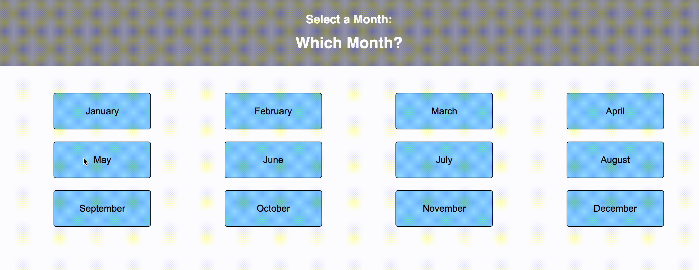

# React Month Picker

## Description

A basic month picker where clicking on each month places that month in the header. The header changes color as you click on each month. Two separate reducers were used in the header; one for changing the selected month and another for changing the headers background color.

## Interface

## Languages

JavaScript, CSS, HTML, Postgresql, and Markdown demonstrated.

## Packages

This is built using Node.js with React, Redux, Express, Axios, and Nodemon utilized.

## Future Updates

There will likely be no updates moving forward. Just a small assignment demonstrating the use of React and Redux together.
